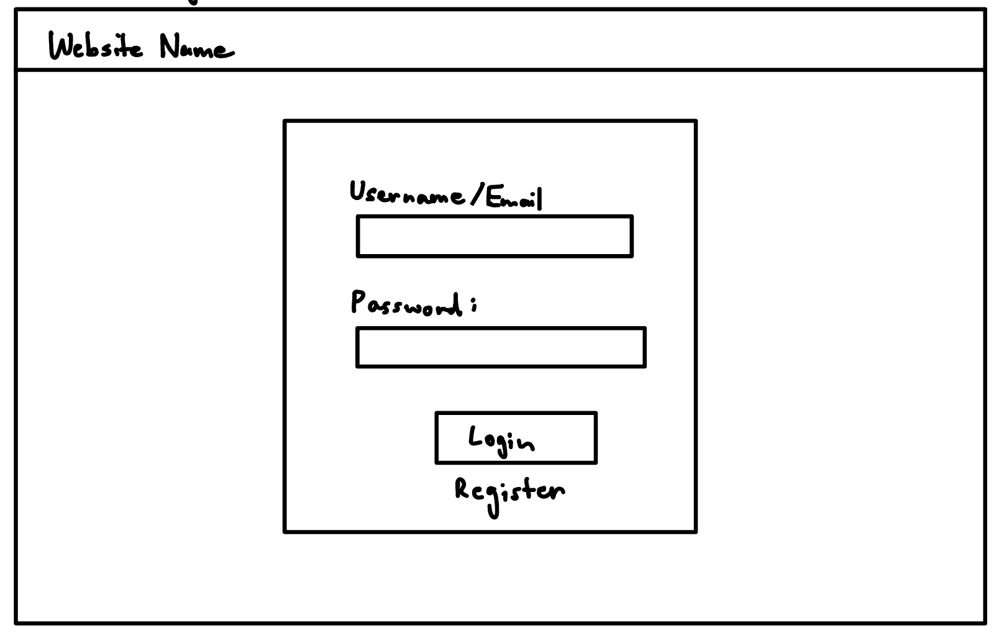
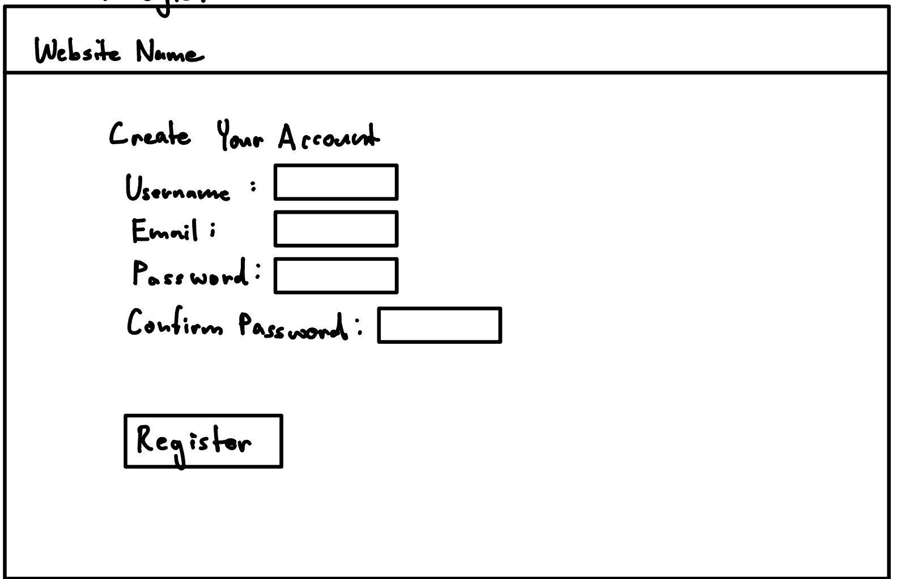
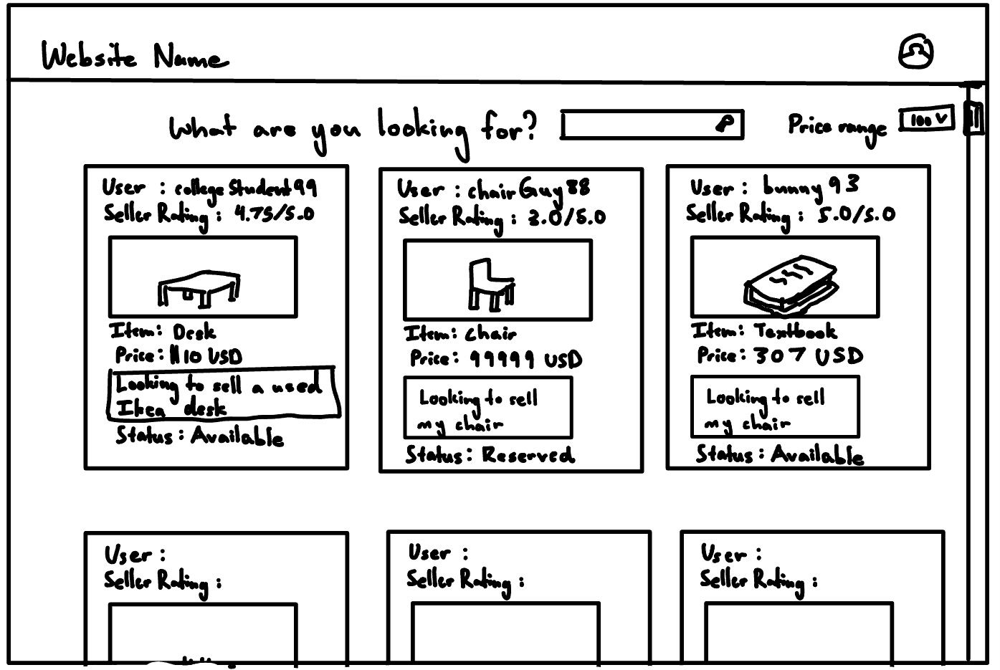
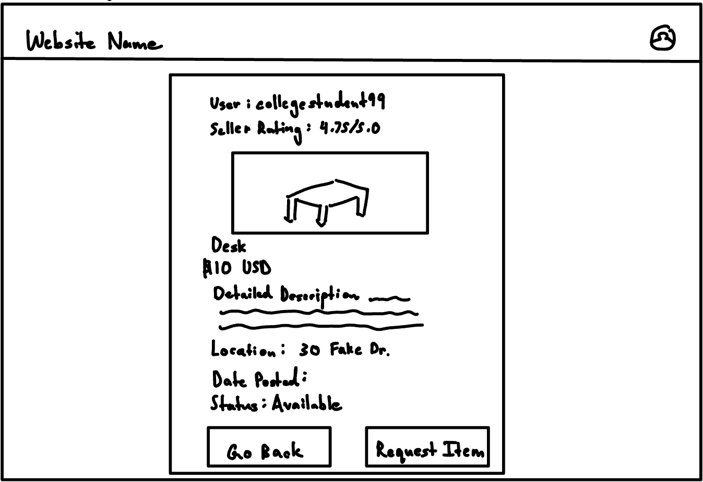
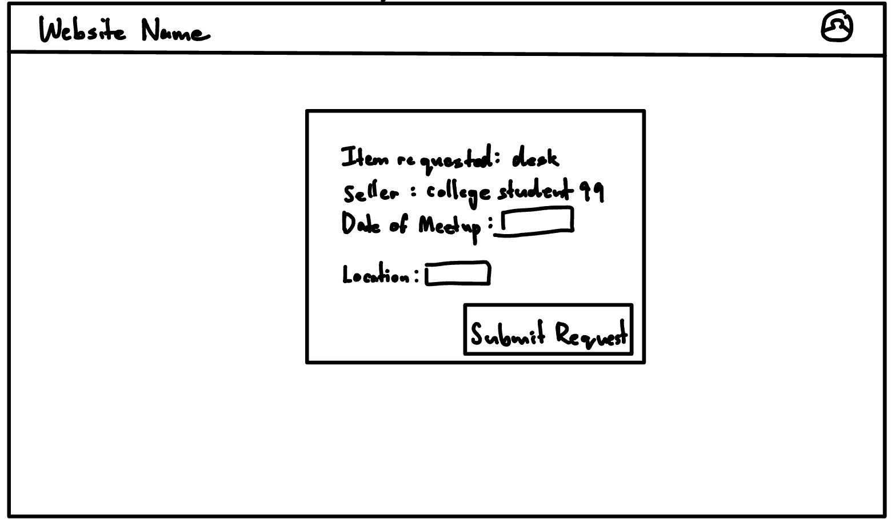
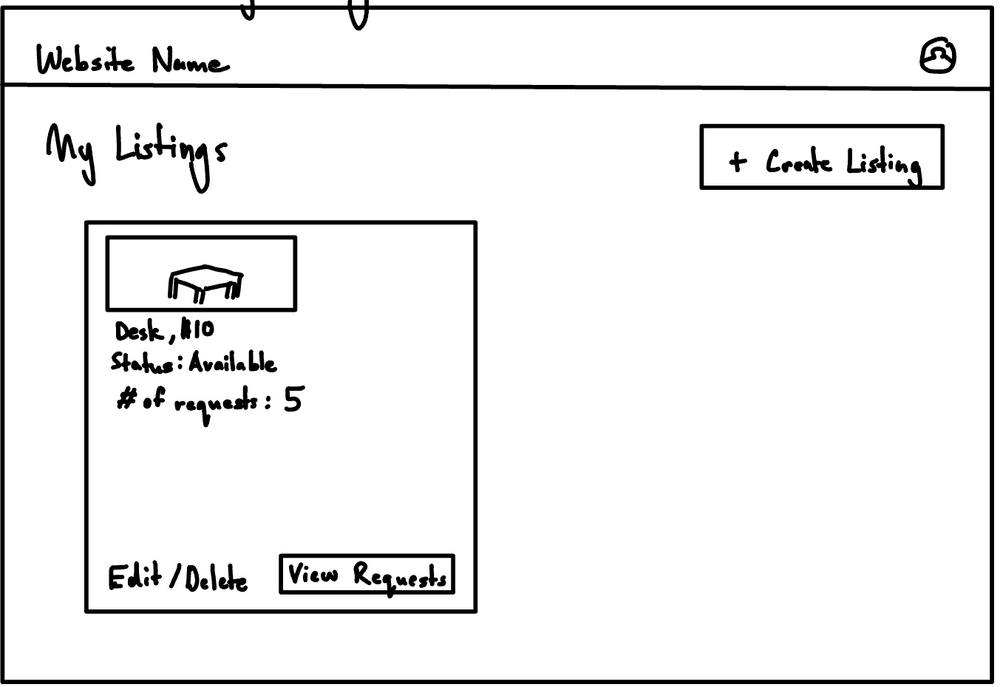
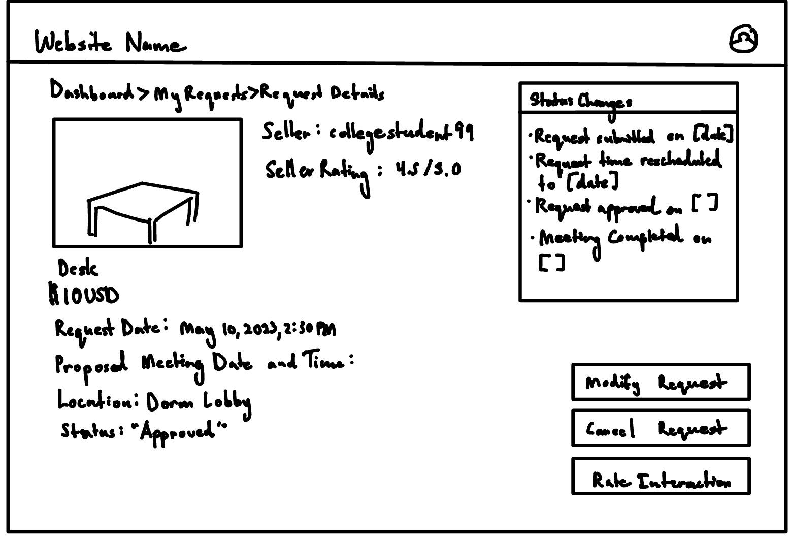
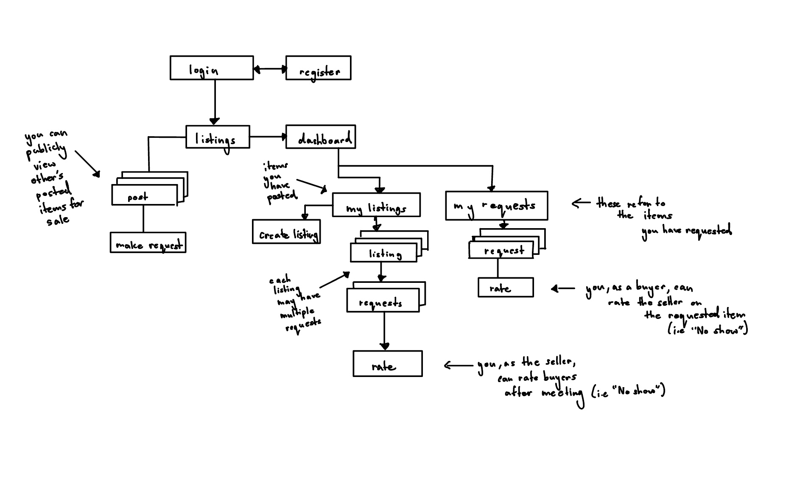

# CampusClearOut

## Overview

CampusClearOut is a web platform designed for university students to buy, sell, or give away furniture and other items at the end of the semester. Managing multiple listings across various platforms can be overwhelming and annoying. CampusClearOut makes this process easier by providing a single spot where students can easily post their items, browse available listings, and coordinate meetups for pickups.

Once students have registered and logged in, they can list their items, browse others’ posts, and schedule meetups to exchange goods. The platform is intended to feature a built-in rating system, allowing sellers and buyers to rate each other’s reliability, including marking "no-shows" for missed meetups to keep things transparent for other students.

## Data Model

The application will store Users, Listings, and Requests
* Users: students who want to use the platform to buy/sell their leftover semester items
* Listings: represents the items that students post for sale/giveaway
* Requests: represents potential meetup agreements between buyers and sellers for purchasing/picking up  furniture

* Users can create multiple Listings (via references).
* Users can initiate multiple Requests (via references).
* Listings can have multiple Requests associated with them (via references).
* Each Request is linked to only one Listing (via references) 


An Example User:

```javascript
{
  username: "student123",
  email: "student123@example.com",
  passwordHash: "hashedpassword",
  listings: ["listingId1", "listingId2"], // references to listings posted by user
  requests: ["requestId1", "requestId2"], // references to requests made by user
  ratings: {
    asSeller: {
      totalScore: 45, // total score from all ratings as a seller
      count: 10 // number of ratings received as a seller
    },
    asBuyer: {
      totalScore: 35, // total score from all ratings as a buyer
      count: 7 // number of ratings received as a buyer
    }
  },
  createdAt: //date and time created
}

```

An Example Listing:

```javascript
{
  title: "Desk",
  description: "A wooden desk in good condition.",
  price: 50,
  images: ["image1.jpg", "image2.jpg"],
  status: "Available",
  seller: "userId123", // reference to the user (seller)
  requests: ["requestId1", "requestId3"], // references to requests made for this listing
  postedAt: //date and time posted
}

```

An Example Request:

```javascript
{
  listing: "listingId1", 
  buyer: "userId456", 
  seller: "userId123", 
  scheduledDate: //date and time for proposed meetup,
  location: "Dorm Lobby",
  status: "Completed",
  buyerRating: {
    score: 4, // rating given by the seller to the buyer after meetup
    feedback: "Buyer was easy to deal with."
  },
  sellerRating: {
    score: 5, // Rating given by the buyer to the seller after meetup
    feedback: "Great seller, item as described."
  },
  createdAt: //time created 
}

```

## [Click Here for Commented First Draft Schema](db.mjs) 


## Wireframes

/login - page for users to log into their accounts


/register - page for users to create a new account


/listings - homepage displaying all available listings


/listings/:postId - page for showing a specific listing post


/listings/:postId/makeRequest - page for requesting a specific listing (item listed)


/dashboard - page for displaying overview of account activities


/dashboard/my-listings - page showing all listings created by user


/dashboard/my-listings/create - page for users to create a new listing


/dashboard/my-listings/:listingId/requests - page showing all requests others have made on a specific listing of the user


/dashboard/my-listings/:listingId/requests/:requestId/rate - page for the user to rate a specific request on one of their listings (e.g., rating "0 stars - no show" when a requester fails to pick up an item).


/dashboard/my-requests - page displaying all requests submitted by the user


/dashboard/my-requests/:requestId - page for viewing details of a specific request made by the user


/dashboard/my-requests/:requestId/rate - page for the user to rate a specific request (e.g., rating "0 stars - no show" when the seller fails to show up with the item)


## Site map



## User Stories or Use Cases

1. As a non-registered user, I can register a new account with the site
2. As a user, I can log in to the site
3. As a user, I can browse all available listings on the homepage
4. As a user, I can create a new listing to sell or give away an item from my dashboard
5. As a user, I can view all of the listings I have created on the "My Listings" page
6. As a user, I can edit or remove an existing listing I created from my "My Listings" page
7. As a user, I can view detailed information about any listing I am interested in
8. As a user, I can submit a request to schedule a meetup for a specific listing
9. As a user, I can view and manage requests for my listings on a page dedicated to each listing's requests
10. As a user, I can approve, decline, or suggest changes to a proposed meetup for a request on one of my listings
11. As a user, I can view all of my submitted requests in a single list on the "My Requests" page
12. As a user, I can check the status of my submitted requests, including approved, pending, or declined
13. As a user, I can report a no-show after the scheduled meetup
14. As a user, I can rate and review the other party (buyer or seller) after a completed or missed meetup


## Research Topics

(__TODO__: the research topics that you're planning on working on along with their point values... and the total points of research topics listed)

* (5 points) Integrate user authentication
    * I'm going to be using passport for user authentication
    * And account has been made for testing; I'll email you the password
* (4 points) Perform client side form validation using a JavaScript library
    * see <code>cs.nyu.edu/~jversoza/ait-final/my-form</code>
    * if you put in a number that's greater than 5, an error message will appear in the dom
* (5 points) vue.js
    * used vue.js as the frontend framework; it's a challenging library to learn, so I've assigned it 5 points

10 points total out of 10 required points 

## [Click Here for Initial Main Project File](app.mjs) 

## Annotations / References Used

None so far